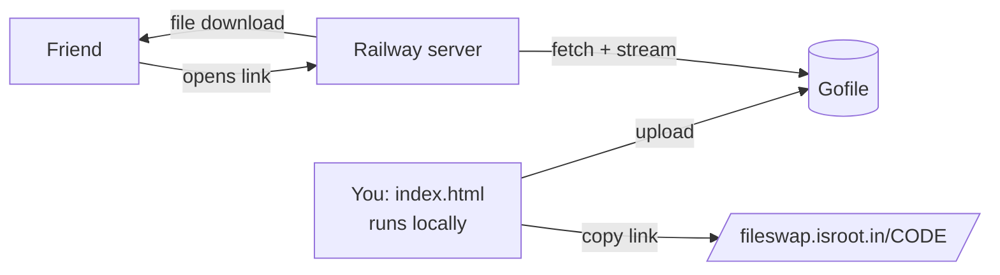

<div align="center">

# 📤 FileSwap

**A tiny temporary file-sharing app.** Upload from a clean drive-style dashboard, share a short link, and your friend downloads straight from your own domain. No Gofile page in sight.


*Made by Amrit*

</div>

---

## ✨ What it does

- 🗂️ **Drive-style dashboard** with list and grid views, search, drag and drop, and folder upload.
- 🔗 **Short share links** like `https://fileswap.isroot.in/AbC123`.
- ⬇️ **Direct downloads** from your own domain. The server fetches the file from Gofile and streams it, so visitors never see Gofile.
- ⏯️ **Resumable downloads** (HTTP Range passes through).
- 🛡️ **Built-in protection** against overload and Gofile throttling (details below).
- 🧩 **Zero dependencies.** The server is one Node file.

## 🧠 How it works



| Part | Where it lives | Job |
|---|---|---|
| `index.html` | **Your computer** (offline) | Upload dashboard. Sends files to Gofile and builds share links. |
| `download.html` | Railway | The page your friend sees. Shows file name and size, then starts the download. |
| `server.js` | Railway | Serves the page and talks to Gofile for downloads. |

> The dashboard stays private on your machine, so only you can upload. Only the download side is public.

## 🚀 Setup

### 1. Put the server on GitHub

The repo only needs these three files at the top level:

```
server.js       (or proxy.js, just match it in package.json)
package.json
download.html
```

`package.json` must start the file you actually have:

```json
{ "scripts": { "start": "node server.js" } }
```

### 2. Deploy on Railway

1. **New Project → Deploy from GitHub repo.**
2. **Settings → Networking → Generate Domain** (or add your own domain, see below).
3. That's it. `PORT` is set by Railway automatically.

Optional variable: `GOFILE_WT_SALT` (see [Troubleshooting](#-troubleshooting)).

### 3. Custom domain (optional)

1. Railway → **Settings → Networking → Custom Domain**, then enter your domain.
2. Add the **CNAME** Railway shows at your DNS provider (plus its TXT record if it asks).
3. A CNAME can't share a name with other records. If your panel adds default records on that name, remove them first.

### 4. Point the dashboard at your site

In your local `index.html`, set:

```js
const ONLINE_DOMAIN = 'https://fileswap.isroot.in/'; // keep the trailing slash
```

Open `index.html` in your browser, upload a file, and use the 🔗 button to copy the share link.

## 🛡️ Built-in protection

| Protection | Why |
|---|---|
| Lookup cache (5 min) | File info and download share one Gofile request. |
| Stale cache (1 hour) | Known files keep working while Gofile throttles you. |
| Cooldown on `429` | The server pauses calls to Gofile when it asks, instead of hammering it. |
| Per-visitor rate limits | Stops one visitor from flooding the server. |
| Parallel download caps | Per visitor and for the whole server. |
| "Not found" memory | Random guessed links don't reach Gofile. |
| Styled 404 and error pages | Proper status codes with a friendly page. |
| Clean shutdown | No scary npm error when Railway redeploys. |

## 🔌 Endpoints

| Route | Purpose |
|---|---|
| `GET /CODE` | Download page (also `/d/CODE`). |
| `GET /api/info?code=CODE` | File name and size as JSON. |
| `GET /api/dl?code=CODE` | Streams the file as an attachment. |
| `GET /health` | Returns `ok`. Handy for uptime checks. |

## 🔧 Troubleshooting

| What you see | What it means | Fix |
|---|---|---|
| `Cannot find module '/app/server.js'` | File name doesn't match the start script. | Rename the file, or edit `start` in `package.json`. |
| `Page missing` | `download.html` isn't next to the server file (or in `public/`). | Move it. |
| `error-notPremium` | Gofile rotated the secret used for its website token. | Set `GOFILE_WT_SALT` in Railway to the new salt (comma separate several). |
| `error-rateLimit` / `429` | Gofile is throttling the server. | Wait. The page retries by itself. |
| `fetch failed` | The connection to Gofile broke, often a short outage. | Log `e.cause?.code`, try another Railway region, or wait. |
| Railway shows a CNAME error but the site works | Usually a cosmetic check on its side. | Ignore it if HTTPS works. |

## ⚠️ Good to know

- **Unofficial.** FileSwap relies on how Gofile's website behaves today. If Gofile changes it, downloads can break until the server is updated.
- **Expiry is only a label.** The dashboard shows 10 days, but Gofile decides when files really disappear.
- **Rename is local.** It changes the name shown in your dashboard only. The download page shows the original name.
- **Not encrypted storage.** Files sit on Gofile as uploaded. HTTPS protects them in transit, nothing more.
- **Public uploads are a different job.** Letting strangers upload would need upload limits, abuse handling and a takedown path. That's a future upgrade, not part of this version.

## 🗺️ Ideas for later

- [ ] Upload through your own server so the browser never talks to Gofile
- [ ] Opaque encrypted share IDs
- [ ] Stricter limits and a public upload page
- [ ] Optional passcode for uploads

## 🙏 Credits

Storage by [Gofile](https://gofile.io). Hosting by [Railway](https://railway.app). Subdomain by isroot.in and devs.surf.

<div align="center">

Made with ☕ by **Amrit**

</div>
